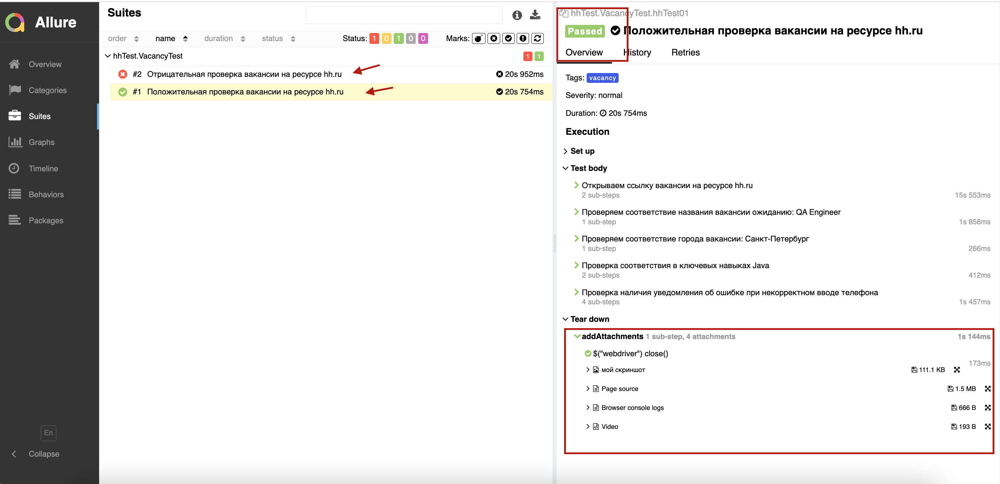
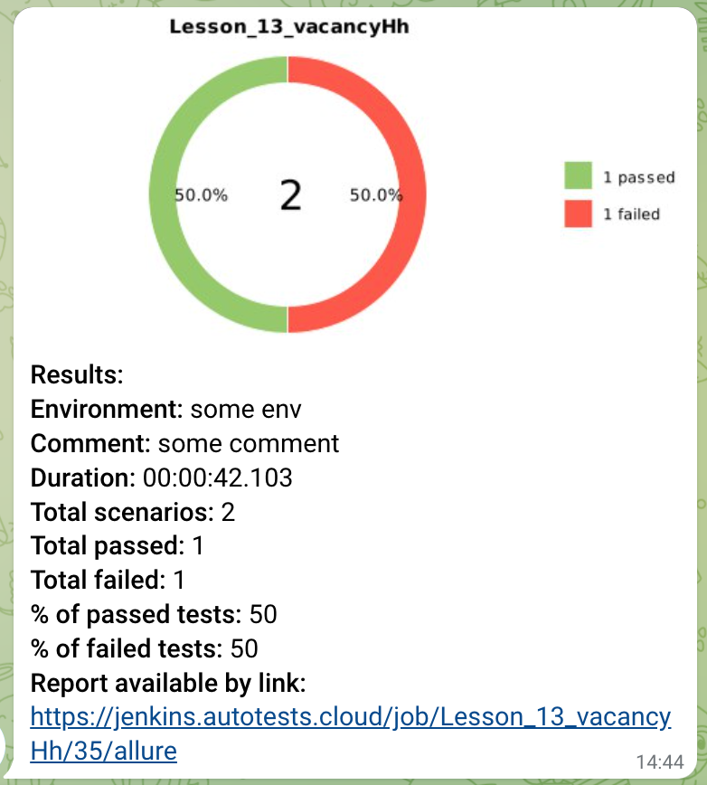
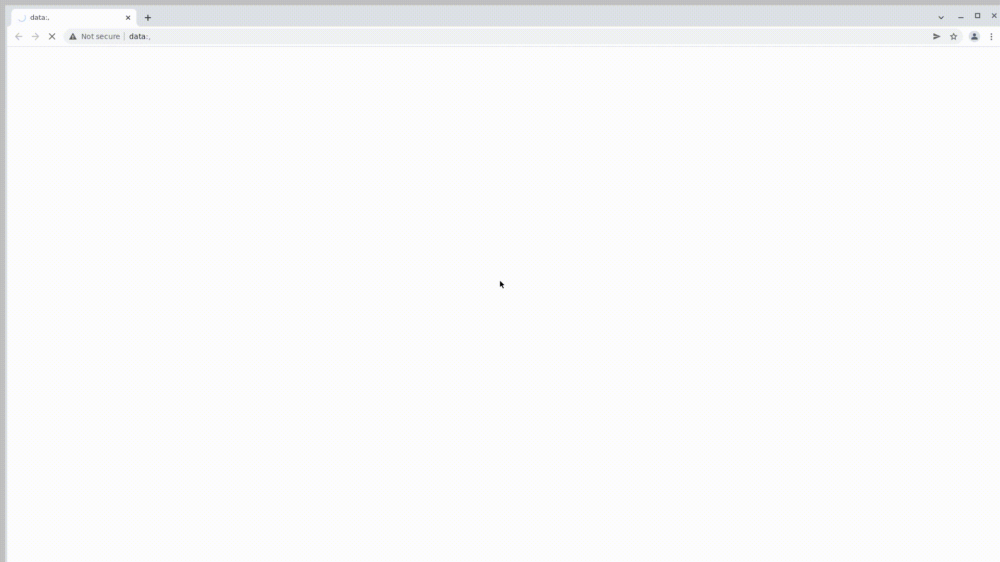

## Проект автоматизации тестирования страницы вакансии на ресурсе hh.ru

---
### Вакансия [QA Engineer](https://spb.hh.ru/vacancy/48204083?query=QA%20engineer&from=vacancy_search_catalog&hhtmFrom=vacancy_search_catalog)

<a id="anchor"></a>

:closed_book: __Содержание__
+ Технологии и инструменты
+ Реализованные проверки
+ Сборка в Jenkins
+ Запуск из терминала
+ Отчет Allure Report
+ Отчет в Telegram
+ Видео примера прохождения теста


:toolbox:__Технологии и инструменты__


---
__Реализованные проверки__

:white_check_mark: _Положительная проверка вакансии_

- [ ] Проверка соответствия названия вакансии ожиданию: QA Engineer
- [ ] Проверка соответствия города вакансии: Санкт-Петербург
- [ ] Проверка соответствия в ключевых навыках:  Java
- [ ] Проверка наличия уведомления об ошибке при некорректном вводе телефона

---

:x: _Отрицательная проверка вакансии_
- [ ] Проверка соответствия в ключевых навыках:  Python

---
:toolbox: __Сборка в Jenkins__

[Проект Lesson_13_vacancyHh](https://jenkins.autotests.cloud/job/Lesson_13_vacancyHh/)


__Параметризированная сборка в Jenkins__

Мы можем собрать джобу с предложенными параметрами, выбрав из выпадающих вариантов:


---
:computer: __Запуск из терминала__

Локальный запуск теста:

```
gradle clean vacancy  
```
Удаленный запуск теста:
```
clean
vacancy
 -Dbrowser=${BROWSER}
 -DbrowserSize=${BROWSER_SIZE}
 -Dremote=${REMOTE}
```

---
:bar_chart: __Отчет Allure Report__

 Обзор


Проведенные тесты с шагами, возможностью просмотра скриншота, лога и видео



---
:incoming_envelope: __Отчет в Telegram__



Кроме красочной инфографики достпупна возможность перейти по ссыле для просмотра отчета:
[просмотреть сейчас ](https://jenkins.autotests.cloud/job/Lesson_13_vacancyHh/35/allure/)

---
:clapper: __Видео примера прохождения теста__

Запуск проходит на удаленном веб-драйвере Selenoid


:arrow_up: [Вверх страницы](#anchor)

---
